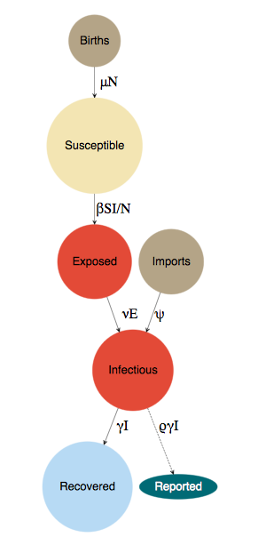

## Overview

This is a report on the second round of results from fitting the stochastic SIR model to data from Niamey using iterated filtering (MIF), as implemented in `pomp::mif2()`.
The report also covers inital analyses that formally link EWS and rate of transmission.


{height=350px}

## Methods

### Stochastic SIR model
The model is a discrete-time approximation of a continuous-time SEIR model (Fig. 1) with limited demography, specified as a set of difference equations,

\begin{align}
S_{t+\delta t} &= n_{S,t} - n_{E,t} \\
E_{t+\delta t} &= n_{E,t} - n_{I,t} \\
I_{t+\delta t} &= n_{I,t} + n_{O,t} - n_{R,t},
\end{align}

\noindent{}where $\textbf{n}_t$ are random variables representing the number of individuals transitioning into or out of each class at each timestep $t \rightarrow t+\delta t$.
$n_{S}$ is the number of births, $n_{E}$ is the number of newly infected individuals that have the disease but are not infectious, $n_{I}$ is the number of newly infectious indiviuals, $n_{O}$ is the number of imported infections, and $n_{R}$ is the number of newly recovered individuals who are no longer infectious and have life-long immunity.
The stochastic random variables are specified as follows:

\begin{align}
n_{S,t} &\sim \text{Poisson}(\mu_t N_t \times \delta t) \\
n_{E,t} &\sim \text{Binomial}(\lambda_{E,t}, S_{t}) \\
n_{I,t} &\sim \text{Binomial}(\lambda_{I,t}, E_{t}) \\
n_{O,t} &\sim \text{Poisson}(\psi \times \delta t) \\
n_{R,t} &\sim \text{Binomial}(\lambda_{R,t}, I_{t}),
\end{align}

\noindent{}where $\mu_t$ is the birth rate at time *t*, $\psi$ is the rate of imported infections, and $\lambda_E$, $\lambda_I$, and $\lambda_R$ are the probabilities of exposure, becoming infectious, and recovery, respectively.
These probabilities reflect the processes of tranmission, transition from the latent period to the infectious period, and recovery, which we model as:

\begin{align}
\lambda_{E,t} &= 1 - e^{-\frac{\beta_t I_t \delta t}{N_t}} \\
\lambda_{I,t} &= 1 - e^{-\eta E_{t} \delta t} \\
\lambda_{R,t} &= 1 - e^{-\gamma I_{t} \delta t},
\end{align}

\noindent{}where $\beta_t$ is time-varying rate of transmission, $\eta$ is time-invariant rate from the exposed class to the infectious class, and $\gamma$ is time-invariant recovery rate.
We model rate of transmission as:

\begin{equation}
\beta_t = \beta \left(1 + \sum^6_{i=1} q_i \xi_{i_{t}} \right) \Gamma_t.
\end{equation}

$\beta$ is the mean transmission rate, $\psi$ accounts for measles infections from external sources that are not part of the local dynamics, and the term $\sum^6_{i=1} q_i \xi_{i_{t}}$ is a B-spline to model seasonality in transmission.
The B-spline bases ($\xi_{i_{t}}$) are periodic with a 1 year period.
The transmission rate ($\beta_t$) is also subject to stochastic process noise at each time step, $\Gamma_t$, which we model as a gamma-distributed white (temporally uncorrelated) noise with mean 1 and variance $\sigma^2$ (Bretó and Ionides 2011).

We do not include a death process in the model because the rate of infection is much faster than the rate of death.
Excluding deaths means we can avoid making further assumptions about demographic rates -- we are already making assumptions about birth rates (e.g., the rate is the same across cities, but with city-specific population size).
We model demographic stochasticity in births and imported infections by drawing time-specific values from Poisson distributions.
Transitions in the model are shown in Table 1.
In this model, the effective reproductive ratio at time *t* is: $\mathcal{R}_{E(t)} = \beta_t / \gamma$.

The data are weekly observations of reported cases.
To relate our model, which iterates on a daily time step, to the data, we created a variable $x$ that is the cumulative number of individuals that transitioned from the exposed class to the infectious class over seven day periods: $x = \sum_{i=1}^7 n_{I,i}$.
We assume observed case reports ($\textbf{y}$) for each week *w* are drawn from a Negative Binomial distribution subject to a constant reporting fraction ($\rho$) and dispersion parameter $\tau$,

\begin{align}
y_w \sim \text{Negative Binomial} \left( \rho x_w, \tau \right).
\end{align}

### Maximization by iterated filtering (MIF)
I started the analysis by making a Latin hypercube sample of parameter values (5000 parameter sets) that served as initial conditions for iterated filtering.
I ran `pomp::mif2()` for all 5000 initial conditions for 100 MIF itertations with 10000 particles and the cooling factor set to 1 (i.e., no cooling).
MIF iterations were then continued for another 100 iteration with 10000 particles with the cooling factor set to 0.95.
At the final iteration, I ran 50 replicate instances of `pomp::pfilter()` with 10000 particles to estimate the log likelihood of the parameters for each of the 5000 MIF estimates and the Monte carlo error.

### Estimating time-varying rate of tranmission and effective reproduction number
To estimate the time-varying rate of tranmission, I ran a particle filter at the MLEs, but with a twist.
I allowed the mean rate of tranmission ($\beta$) to take a random walk with gamma distributed white noise: `beta_t *= rgammawn(0.001, dt)/dt;`, where `beta_t[1]` is equal to the MLE for $\beta$..
I ran the particle filter with 50000 particles and then used the filtering distribution to estimate the time course of transmission.
Similarly, using the time-varying transmission rate, I estimated the effective reproduction number at each time *t* as: $\mathcal{R}_E(t) = \frac{\beta_t}{\gamma} \frac{S_t}{N_t}$.
I extracted the filtering distribution of $\mathcal{R}_E(t)$ with and without the seasonality component.

### Linking EWS and rate of transmission
I calculated 10 candidate EWS from the case incidence data using a 52 week bandwidth.
I then calculate the Spearman's rank correlation ($\rho$) between each EWS and (1) estimated rate of transmission, (2) effective reproduction number without seasonality, and (3) effective reproduction number with seasonality through time.
This resulted in p-values for significance of the correlation and a confidence interval around the point estimate of $\rho$.

## Results

### Traceplots of the iterated filtering paths for the parameter sets with the 200 highest log likelihoods
```{r traces, echo = FALSE, warning=FALSE, message=FALSE}
library(tidyverse)
library(pomp)

DO_CITY <- "Niamey"

mif_traces <- read_csv(paste0("../../results/initial-mif-traces-", DO_CITY, ".csv")) %>%
  slice(2:n())  # remove first row of NAs

mif_finals <- read_csv(paste0("../../results/initial-mif-lls-", DO_CITY, ".csv")) %>%
  slice(2:n())  # remove first row of NAs

best_grids <- mif_finals %>%
  arrange(-loglik) %>%
  slice(1:200) %>%
  pull(do_grid)

mif_traces_long <- mif_traces %>%
  gather(key = parameter, value = value, -do_grid, -iteration) %>%
  filter(do_grid %in% best_grids)

ggplot(mif_traces_long, aes(x = iteration, y = value, group = do_grid)) +
  geom_line(alpha = 0.1) +
  facet_wrap(~parameter, scales = "free_y")
```

### Likelihood surface at final MIF iteration
Red points are those that satisfy $L_i > \text{max}(\mathbf{L}) - 20$, where $L_i$ is the estimated likelihood for initial conditions set *i*.

```{r lik-slice, warning=FALSE, message=FALSE}
last_iter <- mif_traces %>%
  filter(iteration == 100) %>%
  mutate(
    delta_loglik = abs(loglik - max(loglik)),
    close_to_ll = "blue",
    close_to_ll = ifelse(delta_loglik < 20.00001, "red", close_to_ll)
  ) %>%
  filter(delta_loglik < 100) %>%
  dplyr::select(-do_grid, -iteration, -nfail, -delta_loglik,
                -b1, -b2, -b3, -b4, -b5, -b6)

pairs(last_iter[,1:(ncol(last_iter)-1)], col = last_iter$close_to_ll, pch = 1, cex = 0.6)
```

### Parameter estimates with the highest log likelihood
Note that the model was fit with a time-step of 1 day (`delta.t = 1/365`).
```{r mles, echo = FALSE, warning=FALSE, message=FALSE}
mles <- mif_finals %>%
  filter(loglik == max(loglik, na.rm = TRUE)) %>%
  dplyr::select(-do_grid) %>%
  dplyr::select(-b1, -b2, -b3, -b4, -b5, -b6)

measles_pomp <- readRDS(paste0("../../code/measles-pomp-object-", DO_CITY, ".RDS"))
population <- as_tibble(measles_pomp@covar)%>%
  dplyr::select(N) %>%
  slice(1) %>%
  pull(N)

knitr::kable(mles, digits = 5) 
```

Initial estimate of susceptible population is: `r round(mles$S_0*population)`.

### Model simulations at the (current) MLEs
```{r sims, echo = FALSE, warning=FALSE, message=FALSE}
mles <- mif_finals %>%
  filter(loglik == max(loglik, na.rm = TRUE)) %>%
  dplyr::select(-do_grid, -loglik, -loglik_se)

simulate(
  measles_pomp,
  params = unlist(mles),
  nsim = 9,
  as.data.frame = TRUE,
  include.data = TRUE) %>%
  ggplot(aes(x = time, y = reports, group = sim, color = (sim == "data"))) +
  geom_line() +
  scale_color_manual(values = c(`TRUE` = "blue", `FALSE` = "red"))+
  guides(color = FALSE) +
  facet_wrap(~sim, ncol = 2) +
  scale_y_sqrt() +
  theme(strip.text=element_blank())

simulate(
  measles_pomp,
  params = unlist(mles),
  nsim = 9,
  as.data.frame = TRUE,
  include.data = FALSE) %>%
  ggplot(aes(x = time, y = S, group = sim, color = (sim == "data"))) +
  geom_line() +
  scale_color_manual(values = c(`TRUE` = "blue", `FALSE` = "red"))+
  guides(color = FALSE) +
  facet_wrap(~sim, ncol = 2) +
  scale_y_sqrt() +
  theme(strip.text=element_blank())
```

### Filtering distributions of states and parameters of interest

```{r filtering-dists}
filtered_states <- readRDS("../../results/filtered-states-Niamey.RDS") %>%
  unnest()

ggplot(filtered_states, aes(x = date)) +
  geom_ribbon(aes(ymin = lower_95, ymax = upper_95)) +
  geom_line(aes(y = med)) +
  geom_point(aes(y = observation)) +
  facet_wrap(~state, scales = "free_y")

```

### Estimated rate of transmission
```{r beta-ts, echo = FALSE, warning=FALSE, message=FALSE}
# ews_results <- readRDS("../../results/ews-niger-cities.RDS") %>%
#   filter(city == "Niamey (City)")
# 
# beta_results <- read_csv("../../results/transmission-posteriors.csv", col_types = cols()) %>%
#   dplyr::select(-week) %>%
#   mutate(
#     date = unique(ews_results$date)[2:length(unique(ews_results$date))]
#   ) %>%
#   dplyr::select(-time)
# 
# ggplot(beta_results, aes(x = date,  y = med)) +
#   geom_ribbon(aes(ymax = upper, ymin = lower), alpha = 0.3) +
#   geom_line() +
#   labs(x = "Date", y = expression(paste("Rate of transmission, ", beta," (", yr^-1,")"))) +
#   theme_minimal()

```

